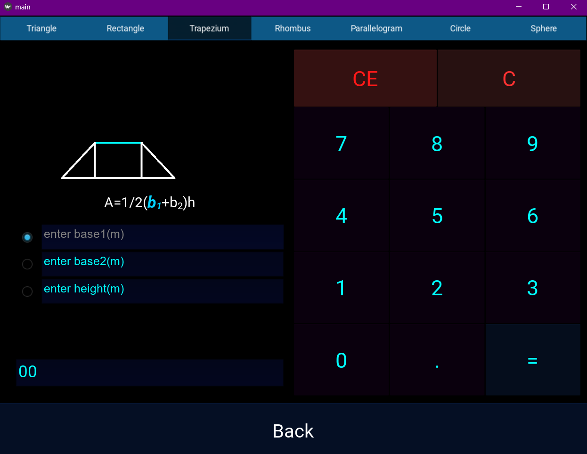

# Project-6
# 🧮 Scientific Calculator with Trigonometric & Geometry Features

This is an **interactive scientific calculator** built with advanced features for **trigonometry, logarithms, inverse trig functions**, and **geometry-based area calculations**.

When calculating the area of a plane figure, the selected shape **lights up dynamically** as you input side lengths, giving a visual guide to your calculation.

---

## ✨ Features

- **Core Math Functions**
  - Addition, subtraction, multiplication, division
  - Power, square root, percentage

- **Trigonometry**
  - `sin`, `cos`, `tan` and their **inverse** forms (`arcsin`, `arccos`, `arctan`)
  - Radian and degree modes

- **Logarithms**
  - Natural log (`ln`) and log base 10
  - Custom base logarithms

- **Geometry**
  - Area calculation for:
    - Triangles
    - Squares
    - Rectangles
    - Circles
    - Trapezoids
    - Parallelograms
  - **Dynamic highlighting** of the chosen figure as dimensions are entered

---

## 📸 Screenshots

### Row Layout

  
  
  

  
  
  

  
  
  

---

